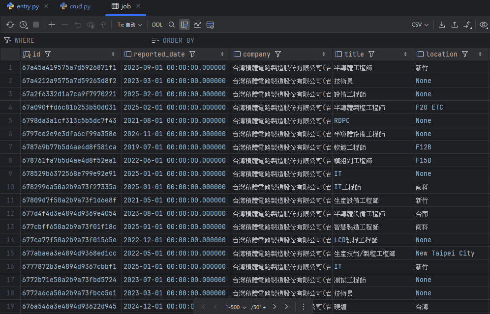
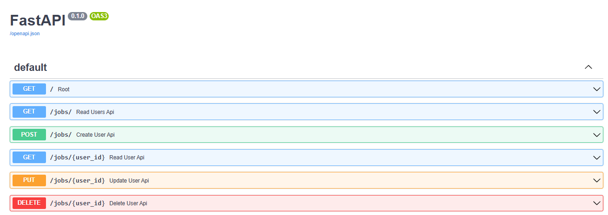
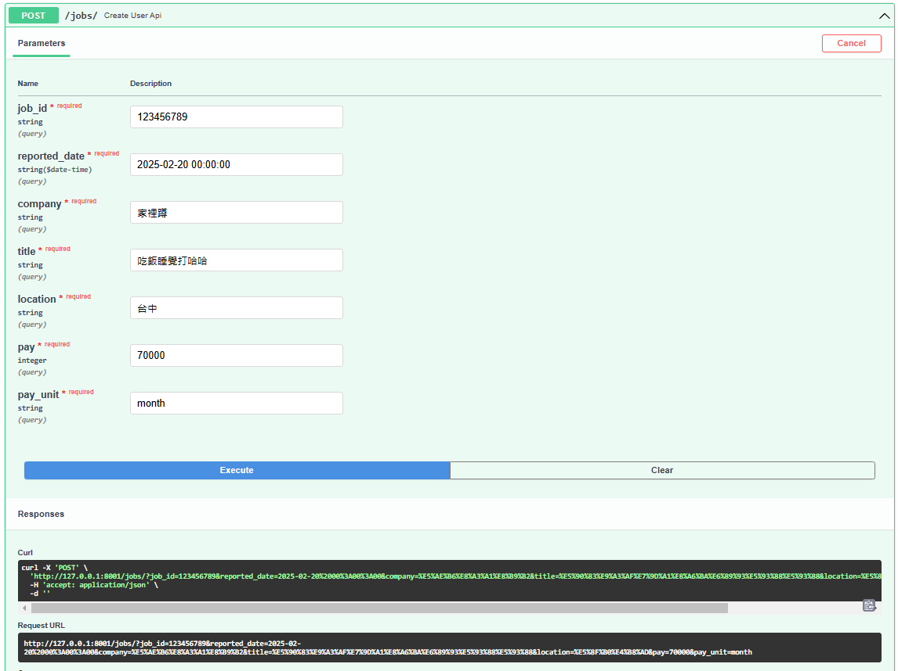
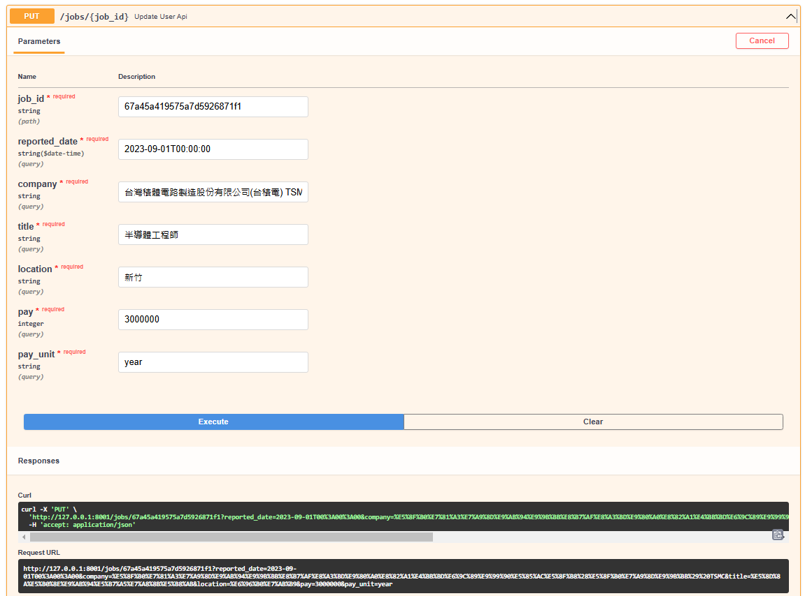
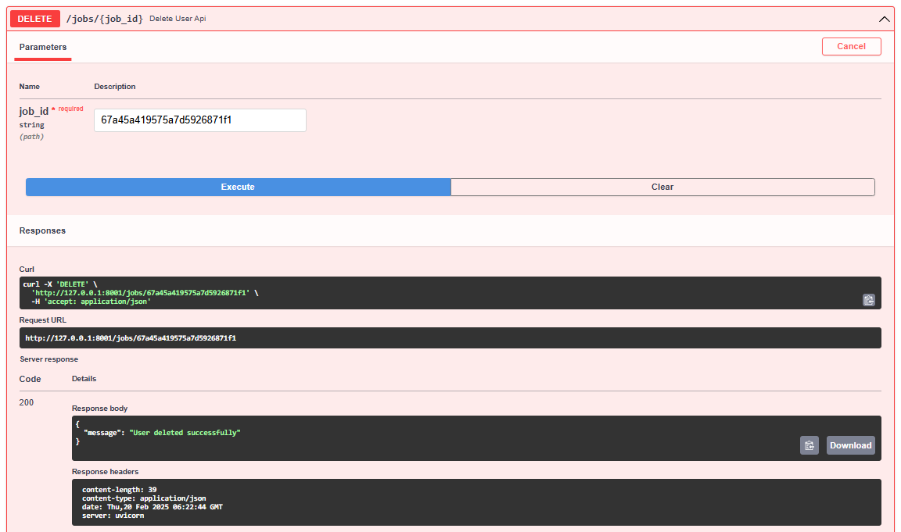

<a href='https://github.com/Junwu0615/RESTful-API-FastAPI'> 
<a href='https://github.com/Junwu0615/RESTful-API-FastAPI'> <br>
[](https://github.com/Junwu0615/RESTful-API-FastAPI)
[](https://www.docker.com/) 
[](https://www.python.org/) <br>
[](https://www.sqlite.org/)
[](https://pypi.org/project/fastapi/)
[](https://pypi.org/project/uvicorn/)
[](https://pypi.org/project/sqlalchemy/) <br>

<br>


## *A.　Showcase Results*
### *a.　任務 : 職場透明化運動之數據，用 Fast API 包裝成 API 文件*

### *b.　數據存儲方式採用 SQLite*
- #### SQLite 無需獨立伺服器的資料庫 ; 而獨立伺服器的有 SQL Server, PostgreSQL, MySQL ... etc.
- #### 它將數據存儲在 `.db` 檔案
- 

### *c.　Swagger API Document*
- ### *http://127.0.0.1:8001/docs*
- 

### *d.　專案功能 : CRUD*
- ### *[ C ] reate*
    ```text
    http://127.0.0.1:8001/jobs/?job_id=123456789&reported_date=2025-02-20%2000%3A00%3A00&company=%E5%AE%B6%E8%A3%A1%E8%B9%B2&title=%E5%90%83%E9%A3%AF%E7%9D%A1%E8%A6%BA%E6%89%93%E5%93%88%E5%93%88&location=%E5%8F%B0%E4%B8%AD&pay=70000&pay_unit=month
    ```
- 

- ### *[ R ] ead*
    ```text
    http://127.0.0.1:8001/jobs/67a45a419575a7d5926871f1/
    ```
- 
  
- ### *[ U ] pdate*
    ```text
    http://127.0.0.1:8001/jobs/67a45a419575a7d5926871f1?reported_date=2023-09-01T00%3A00%3A00&company=%E5%8F%B0%E7%81%A3%E7%A9%8D%E9%AB%94%E9%9B%BB%E8%B7%AF%E8%A3%BD%E9%80%A0%E8%82%A1%E4%BB%BD%E6%9C%89%E9%99%90%E5%85%AC%E5%8F%B8%28%E5%8F%B0%E7%A9%8D%E9%9B%BB%29%20TSMC&title=%E5%8D%8A%E5%B0%8E%E9%AB%94%E5%B7%A5%E7%A8%8B%E5%B8%AB&location=%E6%96%B0%E7%AB%B9&pay=3000000&pay_unit=year
    ```
- 
  
- ### *[ D ] elete*
    ```text
    http://127.0.0.1:8001/jobs/67a45a419575a7d5926871f1
    ```
- 

<br>

## *B.　How To Use*
### *Directory Structure Diagram*
```commandline
RESTful-API-FastAPI/docker
  ├── app
  │   ├── __init__.py
  │   ├── crud.py
  │   ├── database.py
  │   ├── entry.py
  │   ├── model.py
  │   └── requirements.txt
  │
  ├── sqlite_data
  │   ├── fast_api.db
  │   └── hr_vacancies_100.json
  │
  └── script
      ├── docker-compose.yaml
      └── Dockerfile.fastapi
```

### *STEP.1　Clone*
```bash
git clone https://github.com/Junwu0615/RESTful-API-FastAPI.git
```

### *STEP.2　Enter path*
```bash
cd docker/app
```

### *STEP.3　Requirements*
```bash
pip install -r requirements.txt
```

### *STEP.4　Run Service*
```bash
uvicorn entry:app --reload --port 8001
```

<br>

## *C.　Dockerization*
### *STEP.1　Enter `docker` path*
```bash
cd docker
```

### *STEP.2　Create `sqlite_data` Folder*
```bash
md sqlite_data
```

### *STEP.3　基於 Dockerfile build images*
```bash
docker compose --file script/docker-compose.yaml build --no-cache
```

### *STEP.4　背景執行服務*
```bash
docker compose --file script/docker-compose.yaml up -d
```

### *STEP.5　檢視服務啟動狀態*
```bash
docker ps -a
```

<br>

## *D.　Reference*
- ### [[Day7] 簡單搞懂 Restful API Python 實作範例](https://ithelp.ithome.com.tw/m/articles/10295371)
- ### [職場透明化運動](https://www.goodjob.life/)